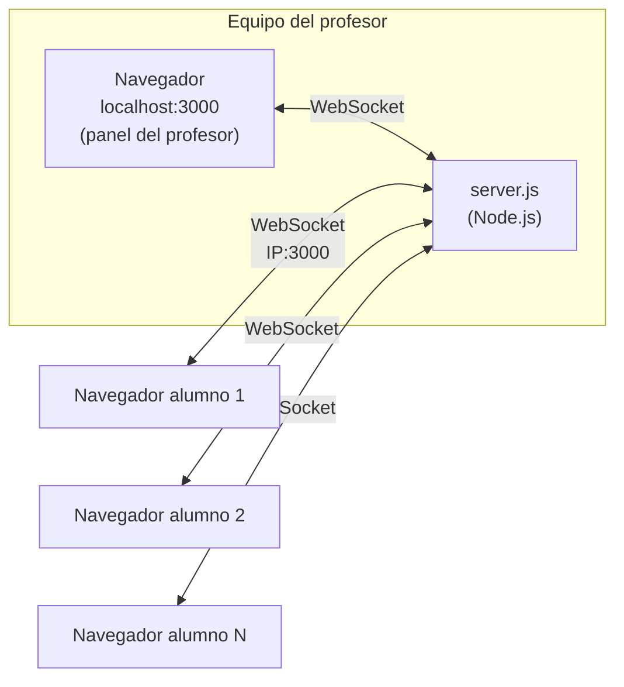
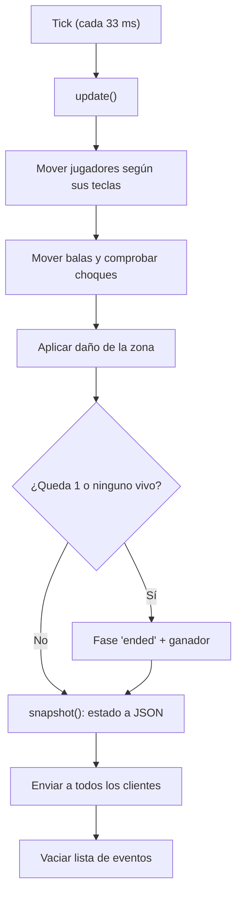
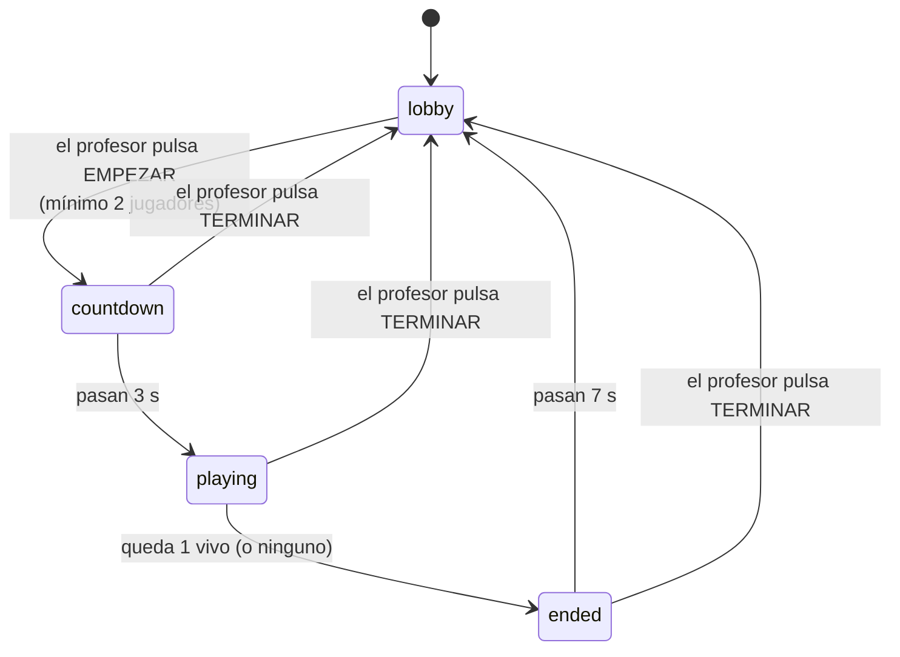
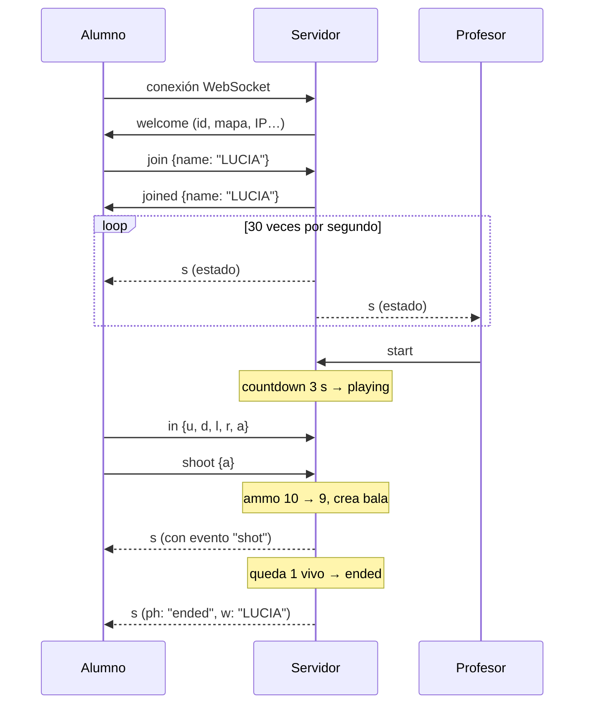

# Arquitectura de 8 BITS BATTLE

Este documento explica cómo está hecho el juego: qué hace cada parte, cómo se comunican y por qué se tomaron ciertas decisiones. Está pensado para quien quiera entender el código o modificarlo.

## 1. Visión general

El juego sigue un modelo **cliente-servidor con servidor autoritativo**:

- El **servidor** (el equipo del profesor) guarda el estado real de la partida y calcula todo: movimiento, balas, impactos, vidas, zona y ganador.
- Los **clientes** (los navegadores de los alumnos) solo hacen dos cosas: **envían lo que pulsa el jugador** y **dibujan lo que el servidor les dice**.



**¿Por qué autoritativo?** Si cada navegador decidiera si ha acertado o cuántas balas le quedan, un alumno podría abrir la consola del navegador y darse balas infinitas. Como el servidor es quien cuenta los 10 tiros y las vidas, el cliente no puede hacer trampas.

## 2. Archivos del proyecto

| Archivo | Qué hace |
|---|---|
| `server.js` | Servidor HTTP + WebSocket y toda la lógica del juego |
| `public/index.html` | Estructura de la página: pantalla de entrada, canvas, marcador y panel lateral |
| `public/style.css` | Estilo retro: fuente pixelada, bordes gruesos y efecto de monitor CRT |
| `public/client.js` | Conexión, controles, dibujo en el canvas y sonidos |
| `package.json` | Declara la única dependencia: `ws` (WebSockets para Node) |
| `INICIAR.bat` | Instala dependencias si faltan, abre el navegador y arranca el servidor |

## 3. Tecnologías

- **Node.js**: ejecuta el servidor.
- **`ws`**: librería de WebSockets para Node. Es la única dependencia externa.
- **Módulo `http` de Node**: sirve los archivos de `public/` sin necesidad de Express.
- **Canvas 2D**: dibuja el juego en el navegador.
- **WebAudio**: genera los sonidos de 8 bits con osciladores, sin archivos de audio.

El mismo puerto (3000) sirve la página web (HTTP) y la conexión del juego (WebSocket). Por eso los alumnos solo necesitan una dirección.

## 4. El servidor (`server.js`)

### 4.1 Bloques del archivo

1. **Configuración**: las constantes que definen el juego (`MAX_SHOTS = 10`, `MAX_HP = 3`, velocidades, tiempos de la zona…).
2. **Mapa**: un array de 30 × 20 cadenas donde `#` es muro y `.` es suelo. Cada casilla (*tile*) mide 16 px, así que el mundo mide 480 × 320 px.
3. **Utilidades de red**: detección de la IP del aula y limpieza de nombres.
4. **Estado del juego**: jugadores, balas, fase y ganador.
5. **Lógica**: `update()`, disparos, daño y zona.
6. **Servidor HTTP**: sirve solo los archivos de una lista blanca (`STATIC`).
7. **WebSockets**: gestiona conexiones y mensajes.
8. **Bucle principal**: `setInterval` a 30 Hz.

### 4.2 El bucle de juego (game loop)

Cada 33 ms (30 veces por segundo) el servidor ejecuta:



### 4.3 Fases de la partida



- **lobby**: sala de espera. Los alumnos entran con su nombre.
- **countdown**: cada jugador aparece en una posición lo más alejada posible de los demás (`randomSpawn`) con 3 vidas y 10 tiros.
- **playing**: se juega. Quien se conecta ahora espera a la siguiente partida (`inGame = false`).
- **ended**: pantalla del ganador y vuelta automática a la sala.

### 4.4 Datos de cada jugador

```js
{
  id, ws,              // identificador y su conexión
  name, color,
  joined,              // ha puesto nombre
  isHost,              // se conecta desde el propio equipo (localhost)
  inGame, alive,       // participa en la partida actual / sigue vivo
  x, y, angle,         // posición y hacia dónde apunta
  hp, ammo, kills,     // vidas, tiros restantes, bajas
  input: { u, d, l, r },
  lastShot, lastZoneHit
}
```

### 4.5 Física y colisiones

- **Jugadores**: son una caja de 12 × 12 px. El movimiento se aplica **eje por eje**: primero X y después Y, comprobando muros cada vez. Así, si chocas en diagonal contra una pared, resbalas por ella en vez de quedarte parado.
- **Balas**: avanzan 6 px por tick en **dos sub-pasos de 3 px** para que no atraviesen muros ni jugadores. Desaparecen al chocar con un muro, al dar a un jugador (nunca a quien la disparó) o a los 3 segundos.
- **Disparo**: el servidor comprueba que la partida está en marcha, que el jugador vive, que le quedan tiros y que han pasado 350 ms desde el último disparo. Si falla algo, ignora la petición.

### 4.6 La zona

Si todos se quedan sin balas, la partida podría no terminar nunca. La zona lo evita:

- Durante los primeros 25 s no hace nada.
- Después, un círculo centrado en el mapa se reduce de forma lineal hasta desaparecer en 60 s.
- Quien está fuera pierde 1 vida cada 1,5 s.

Así la partida siempre acaba. Si los dos últimos mueren en el mismo tick, es empate.

### 4.7 ¿Quién es el profesor?

El servidor mira la **dirección IP de origen** de cada conexión. Si es `127.0.0.1` o `::1` (el propio equipo, es decir, `localhost`), ese cliente es el host y puede enviar `start` y `stop`. Los mensajes `start` y `stop` de cualquier otro cliente se ignoran.

### 4.8 Detección de la IP del aula

Un equipo puede tener varias tarjetas de red, incluidas las virtuales de VirtualBox o VMware. Para mostrar la correcta, el servidor:

1. Crea un socket UDP y lo "conecta" a `8.8.8.8`. Esto no envía ningún paquete, pero hace que el sistema elija la tarjeta de salida real.
2. Lee la IP local de ese socket.
3. Si falla, muestra todas las IP cuyo nombre de tarjeta no parezca virtual.

## 5. El cliente (`public/client.js`)

### 5.1 Responsabilidades

| Parte | Descripción |
|---|---|
| Conexión | Abre `ws://<host>` y, si se cae, reintenta cada 2 s |
| Controles | Guarda las teclas WASD/flechas, calcula el ángulo del ratón y envía `shoot` al hacer clic o pulsar espacio |
| Recepción | Guarda los dos últimos estados (`prev` y `curr`) y procesa los eventos |
| Dibujo | Bucle `requestAnimationFrame` (~60 fps) que pinta el mapa, la zona, las balas, los jugadores, las partículas y los textos |
| Interfaz HTML | Marcador de vidas y tiros, lista de jugadores e historial de bajas |
| Sonido | Pitidos de onda cuadrada con WebAudio |

### 5.2 Envío de controles

El cliente **no envía un mensaje por cada tecla**. Guarda el estado de las teclas en `keys` y marca `inputDirty = true` cuando cambia algo. Un temporizador cada 50 ms (20 Hz) envía el estado solo si ha cambiado. Así se ahorra red cuando hay 25 alumnos a la vez.

### 5.3 Interpolación

El servidor manda posiciones 30 veces por segundo, pero la pantalla se redibuja unas 60. Para que el movimiento sea suave, el cliente **interpola** entre las dos últimas posiciones recibidas:

```
t = (ahora - tiempoÚltimoEstado) / (tiempoÚltimoEstado - tiempoPenúltimo)
posición = anterior + (actual - anterior) * t
```

### 5.4 Dibujo pixel-art

- El mundo mide 480 × 320 px, pero el canvas interno es de 960 × 640 (`SCALE = 2`), de modo que cada píxel del juego ocupa 2 × 2. Así los textos se ven nítidos.
- El CSS usa `image-rendering: pixelated` para que el navegador no difumine al agrandar.
- El mapa se dibuja **una sola vez** en un canvas aparte (`mapLayer`) y en cada frame se copia entero. Es mucho más rápido que redibujar 600 casillas.
- Los personajes son un sprite de 10 × 10 definido como texto (`SPRITE`), que se voltea según hacia dónde apuntes.

## 6. Protocolo de mensajes

Todos los mensajes son JSON. El campo `t` indica el tipo.

### Cliente → servidor

| `t` | Campos | Cuándo |
|---|---|---|
| `join` | `name` | El alumno pulsa "¡A LUCHAR!" |
| `in` | `u, d, l, r` (booleanos), `a` (ángulo en radianes) | Cambian las teclas o el apuntado (máx. 20/s) |
| `shoot` | `a` | Clic o espacio |
| `start` | – | Solo host: empezar partida |
| `stop` | – | Solo host: volver a la sala |

### Servidor → cliente

| `t` | Campos | Cuándo |
|---|---|---|
| `welcome` | `id, isHost, ips, port, map, tile, maxShots, maxHp` | Nada más conectar |
| `joined` | `name` (ya limpio y sin repetir) | Tras un `join` válido |
| `s` | ver abajo | 30 veces por segundo |

**Mensaje de estado `s`:**

```jsonc
{
  "t": "s",
  "ph": "playing",          // fase
  "cd": 0,                  // segundos de cuenta atrás
  "zt": 12,                 // segundos hasta que empiece la zona
  "z": 298,                 // radio actual de la zona
  "w": null,                // nombre del ganador
  "p": [ { "id": 3, "n": "LUCIA", "c": "#ff004d", "x": 120.5, "y": 88,
           "a": 1.57, "hp": 2, "am": 7, "al": true, "ig": true, "k": 1 } ],
  "b": [ [140, 90], [300, 210] ],   // balas [x, y]
  "e": [ { "k": "hit", "id": 3 } ]  // eventos de este tick
}
```

Los nombres de campo son cortos (`n`, `hp`, `am`…) porque este mensaje se envía 30 veces por segundo a cada alumno.

**Eventos (`e`):** `shot` (alguien dispara), `hit` (alguien recibe daño), `wall` (una bala choca con un muro), `kill` (con `killer` y `victim`) y `end` (con `winner`). El cliente los usa para los sonidos, las partículas, la vibración de pantalla y el historial de bajas.

### Ejemplo de una partida



## 7. Seguridad y robustez

- **Servidor autoritativo**: la munición, las vidas y los impactos solo se calculan en el servidor.
- **Validación**: los mensajes con JSON inválido, ángulos que no son números o tipos desconocidos se ignoran.
- **`maxPayload: 1024`**: rechaza mensajes de más de 1 KB.
- **Nombres**: se quitan los caracteres de control y `< >`, se cortan a 12 caracteres y, si se repiten, se añade un número. Además, el cliente los pinta con `textContent`, nunca con `innerHTML`, así que no se puede inyectar HTML.
- **Archivos**: el servidor HTTP solo entrega los archivos de la lista blanca, así que nadie puede pedir `server.js` ni otros archivos del equipo.
- **Desconexiones**: si un alumno se va a mitad de partida, cuenta como eliminado. El cliente se reconecta solo y vuelve a entrar con el nombre guardado.

## 8. Cómo modificar el juego

| Quiero… | Dónde |
|---|---|
| Cambiar tiros, vidas o velocidad | Constantes al principio de `server.js` |
| Quitar la zona | Poner `ZONE_DELAY` muy alto (p. ej. `9999999`) |
| Cambiar el mapa | Array `MAP` en `server.js` (todas las filas con la misma longitud) |
| Cambiar el aspecto de los personajes | Array `SPRITE` en `client.js` |
| Cambiar los sonidos | Objeto `sfx` en `client.js` |
| Añadir un mensaje nuevo | Un `case` en el `switch` de `ws.on('message')` del servidor y un `send({...})` en el cliente |
| Usar otro puerto | Variable de entorno `PORT` o la constante `PORT` |
